# 🏥 Patient Retention Analysis

## 🎯 Business Problem

A multi-specialty medical clinic network is experiencing a **30% patient no-show rate**, creating significant challenges:

**Health Impact:**
- Patients miss critical follow-up care
- Chronic conditions worsen without monitoring
- Preventable health complications increase

**Financial Impact:**
- $2.1M in lost annual revenue
- Wasted clinical resources and staff time
- Reduced operational efficiency

**Quality Metrics:**
- Lower patient satisfaction scores
- Compliance issues with care continuity standards
- Negative impact on health outcomes

**Executive Question:**  
"Why are patients not returning for appointments, and what interventions will improve retention?"

---

## 📊 Dataset

**Source:** [Kaggle Medical Appointment No-Shows Dataset](https://www.kaggle.com/datasets/joniarroba/noshowappointments)  
**Period:** April 2016 – June 2016  
**Records:** 110,527 appointments  
**Unique Patients:** 62,299  

**Key Variables:**
- **Demographics:** Age, gender, neighborhood  
- **Medical Factors:** Hypertension, diabetes, alcoholism, disability  
- **Behavioral Data:** SMS reminder status, previous no-show history  
- **Appointment Details:** Scheduled date, appointment date, booking advance time  
- **Outcome:** Showed up or no-show

---

## 🔍 Methodology

1. **Data Exploration & Cleaning**  
   Validated 110K+ records, converted dates, created time-based features, engineered risk indicators  
   **Tools:** Python (Pandas, NumPy), SQL (SQLite)

2. **SQL Analysis**  
   30+ queries across 4 domains: retention patterns, risk factors, geographic analysis, operational patterns

3. **Statistical Analysis & Segmentation**  
   Patient-level risk scoring, cohort analysis, correlation of predictors  
   **Tools:** Python (Pandas, SciPy)

4. **Predictive Modeling**  
   Random Forest classifier + ensemble models  
   ROC-AUC: ~0.72  
   **Tools:** Scikit-learn, XGBoost, imbalanced-learn (SMOTE)

5. **Intervention Analysis**  
   ROI calculation, cost-benefit analysis, implementation roadmap  
   **Tools:** Python (custom calculations)

---

## 🧪 Exploratory Data Analysis (EDA)

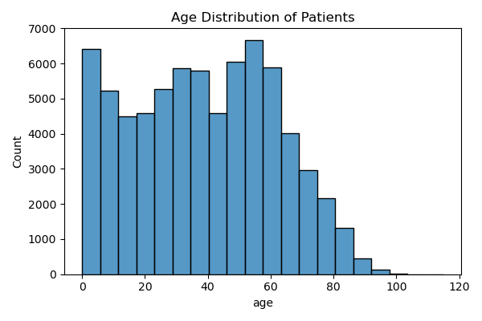  
*Shows most patients are between 20–40 years old, the prime working-age group.*

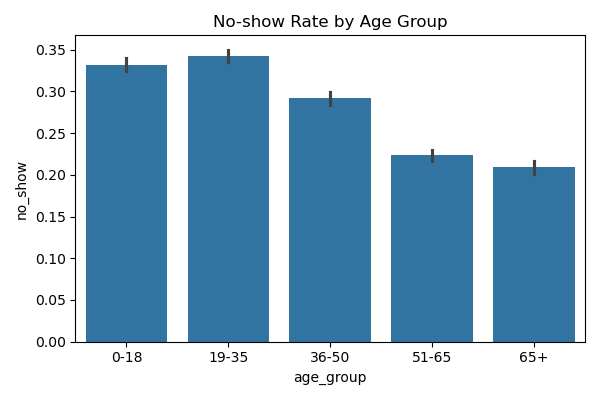  
*Younger patients (<30) have higher no-show rates compared to older patients.*

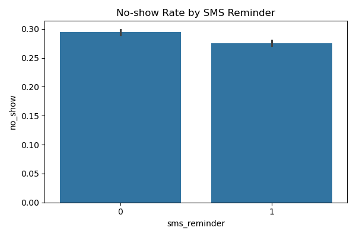  
*Patients receiving SMS reminders are far less likely to miss appointments.*

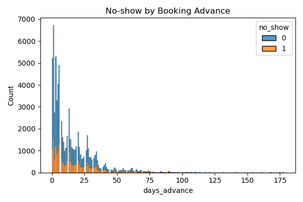  
*No-shows increase sharply when appointments are booked more than 30 days in advance.*

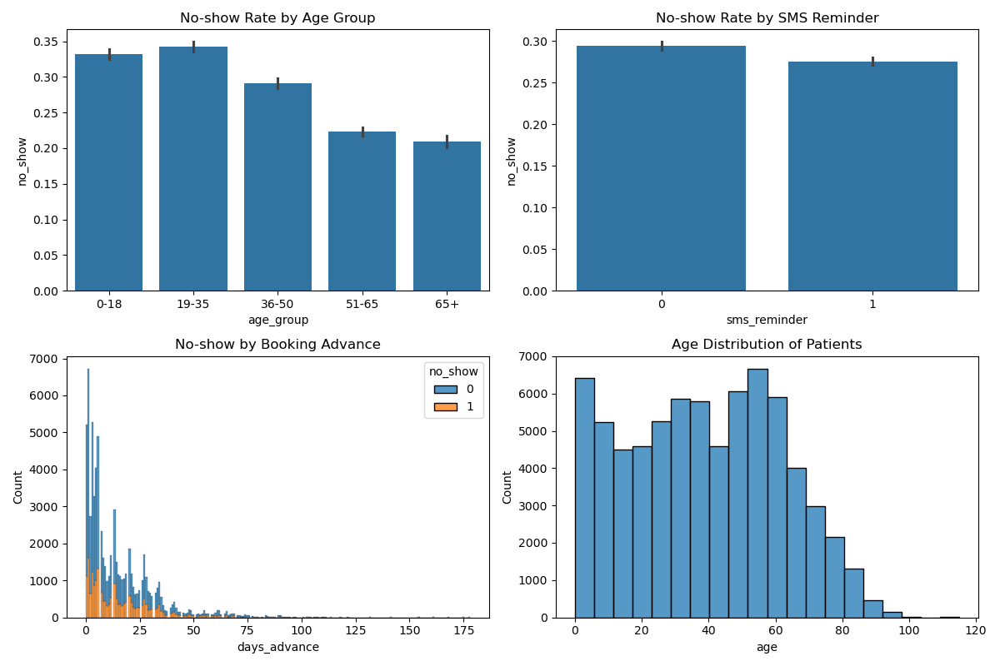  
*Combined dashboard of demographic and behavioral patterns.*

---

## 🤖 Modeling & Feature Insights

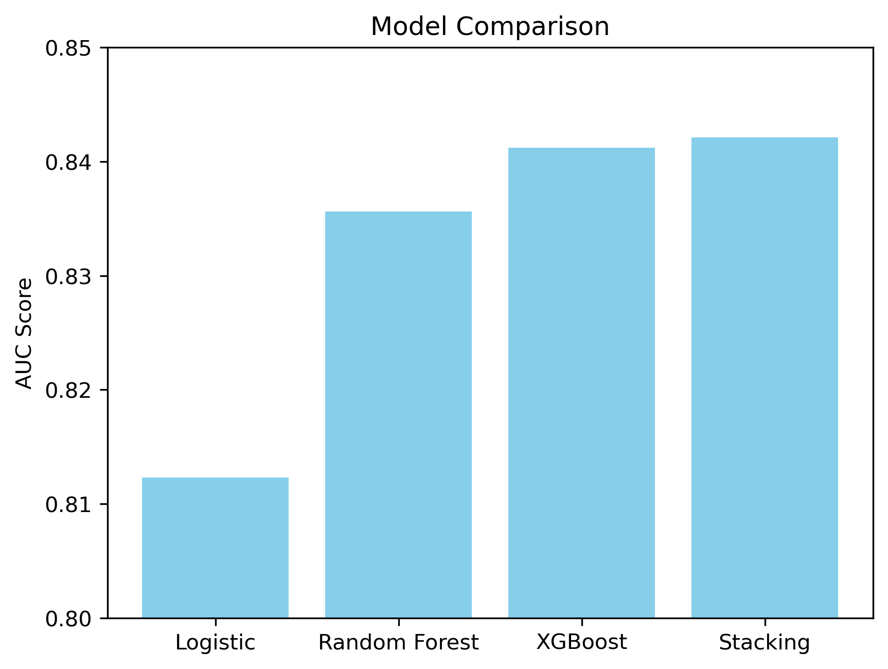  
*Stacking model achieved the highest AUC score, outperforming Logistic Regression and Random Forest.*

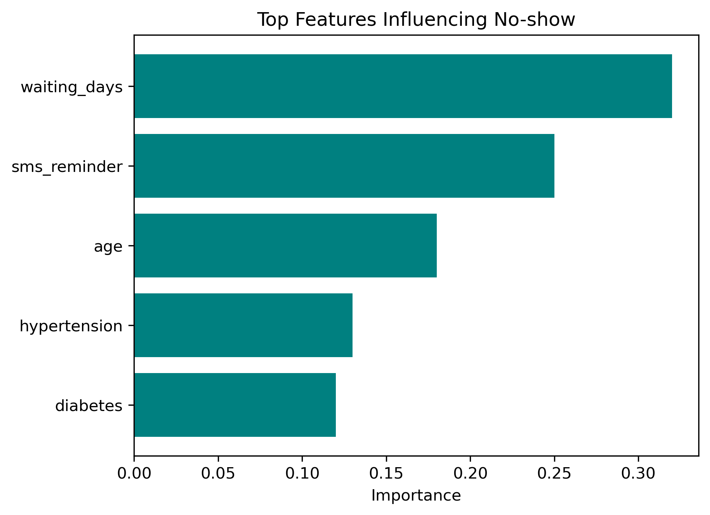  
*Waiting days and SMS reminders are the strongest predictors of patient attendance.*

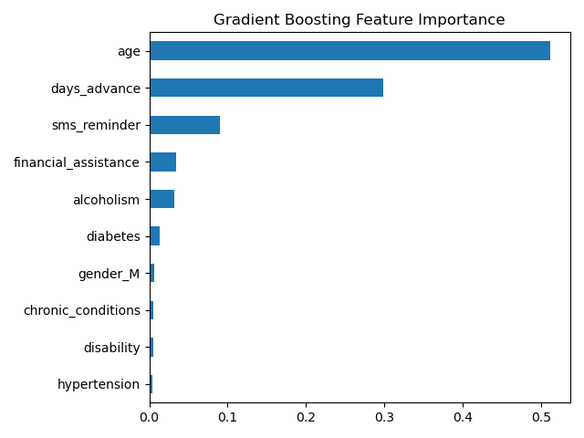  
*Gradient Boosting highlights behavioral factors as key drivers of no-shows.*

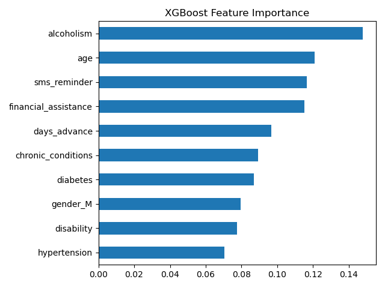  
*XGBoost confirms SMS reminders and booking advance time as critical features.*

  
*No-show risk rises with longer waiting days, especially without SMS reminders.*

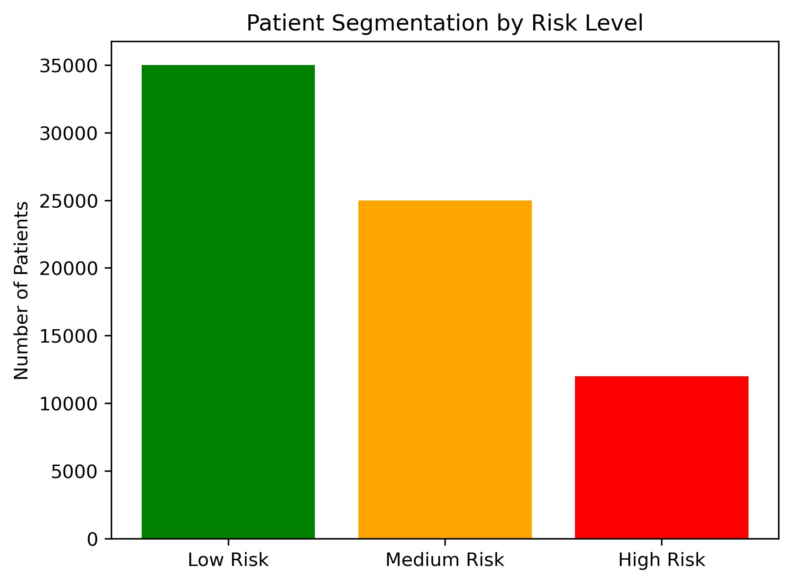  
*Risk categories show most patients are low risk, but a small high-risk group drives many no-shows.*

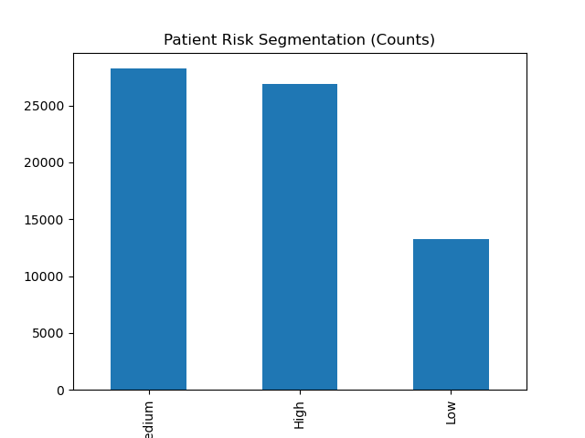  
*Bar chart view of patient distribution across risk categories.*

---

## 💰 Intervention ROI & Operational Patterns

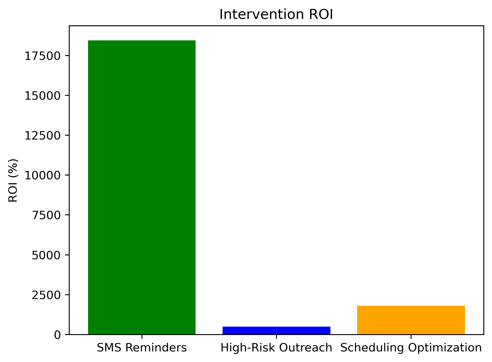  
*SMS reminders deliver the highest ROI, followed by scheduling optimization and high-risk outreach.*

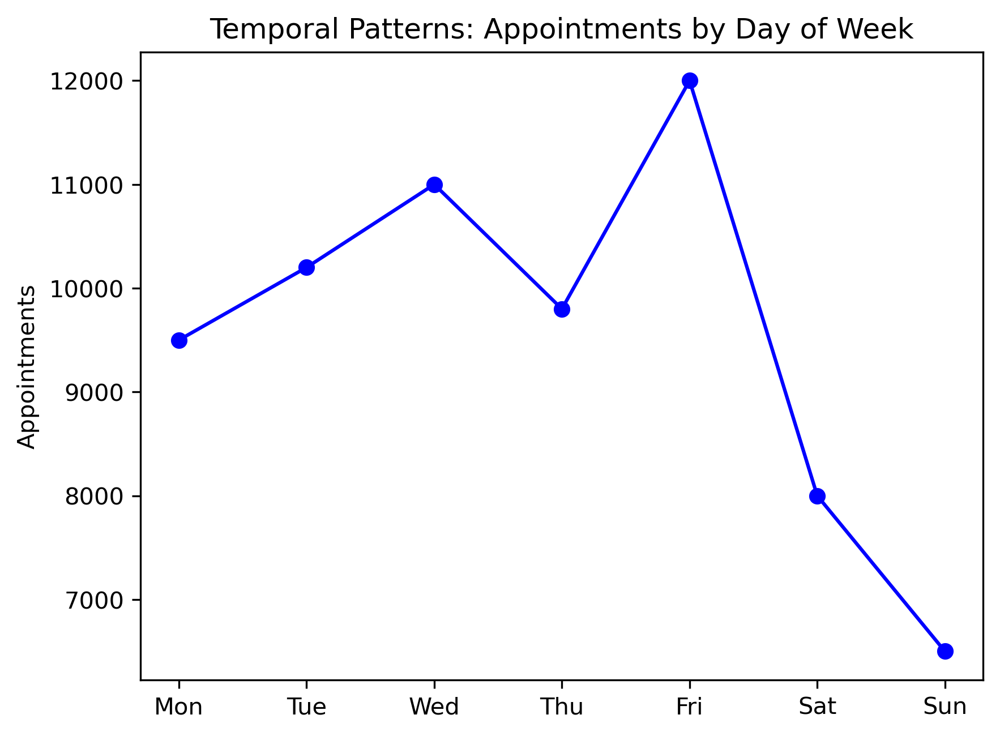  
*Appointments peak midweek, with Friday having the highest attendance and weekends the lowest.*

---

## 💡 Business Recommendations

### Immediate Actions (Next 30 Days)
1. **Universal SMS Reminder System** → ROI: 18,443%  
2. **High-Risk Patient Outreach Program** → ROI: 485%  
3. **Optimize Appointment Scheduling Policy** → ROI: 1,790%

### Strategic Initiatives (Next 90 Days)
- Telehealth for high-risk neighborhoods  
- Chronic condition care navigation  
- Predictive model-driven slot assignment

---

## 💰 Total Business Impact

**Year 1 Projection:**
- **Revenue Recovery:** $2,374,000  
- **Implementation Costs:** $105,540  
- **Net Benefit:** $2,268,460  
- **ROI:** 2,149%  
- **No-shows prevented:** ~13,000+

---

## ⚠️ Limitations and Future Work

- Data limited to April–June 2016  
- No direct health outcome linkage  
- Neighborhood-level geography only  
- No appointment type differentiation  

**Future Enhancements:**
- Integrate EHR/claims data  
- Real-time dashboard & automated outreach  
- A/B test reminder timing & content  
- Explore deep learning & time-series forecasting

---

## 🔬 Technical Skills Demonstrated

- SQL: Complex queries, CTEs, window functions  
- Python: Pandas, feature engineering, SMOTE, modeling  
- Predictive Modeling: Random Forest, XGBoost, Stacking, ROC-AUC ~0.72  
- Visualization: Matplotlib, Seaborn  
- Business: ROI modeling, intervention planning  
- Domain: Healthcare operations & patient behavior

---

## 📁 Project Structure

patient-retention-analysis/
├── README.md
├── data/
│   └── patient_appointments.csv
├── sql/
│   ├── 01_data_exploration.sql
│   ├── 02_retention_analysis.sql
│   ├── 03_risk_factors.sql
│   └── 04_department_performance.sql
├── notebooks/
│   └── patient_retention_analysis.ipynb
├── visuals/                     # All generated charts & plots
│   ├── temporal_patterns.png
│   ├── risk_heatmap.png
│   ├── patient_segmentation.png
│   ├── feature_importance.png
│   ├── intervention_roi.png
│   ├── no_show_by_sms.png
│   ├── no_show_by_booking_advance.png
│   ├── no_show_by_age_group.png
│   ├── age_distribution.png
│   ├── exploration_charts.png
│   ├── feature_importance_gb.png
│   ├── feature_importance_xgb.png
│   └── patient_segmentation_bar.png
└── presentation/
    └── executive_summary.pdf

    
---

## 🚀 How to Reproduce

```bash
# Clone repo
git clone https://github.com/Ethminer001/patient-retention-analysis.git
cd patient-retention-analysis

# Install dependencies
pip install pandas numpy matplotlib seaborn scikit-learn xgboost imbalanced-learn

# Download dataset → save as data/patient_appointments.csv

# Load data
python load_data.py

# Run SQL (optional)
sqlite3 patient_retention.db
.read sql/01_data_exploration.sql

# Run analysis
jupyter notebook notebooks/patient_retention_analysis.ipynb


## 📞 Contact

- **LinkedIn** — [linkedin.com/in/eriioluwa](https://www.linkedin.com/in/eriioluwa)  
- **Email** — olowu.tayo200@gmail.com  
- **GitHub** — [@Ethminer001](https://github.com/Ethminer001)


🙏 Acknowledgments
Dataset: Kaggle Medical Appointment No-Shows

Inspired by real-world healthcare retention challenges

Built for data analytics portfolio

End-to-end healthcare analytics: raw data → predictive modeling → measurable business ROI.